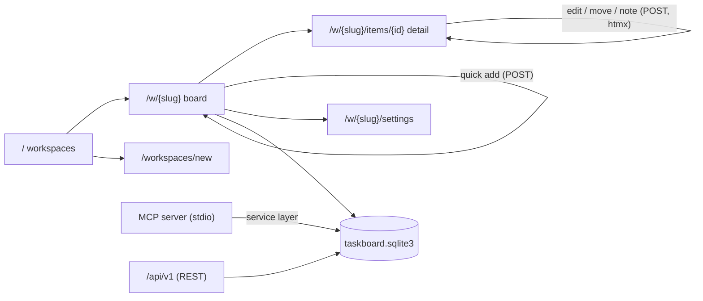
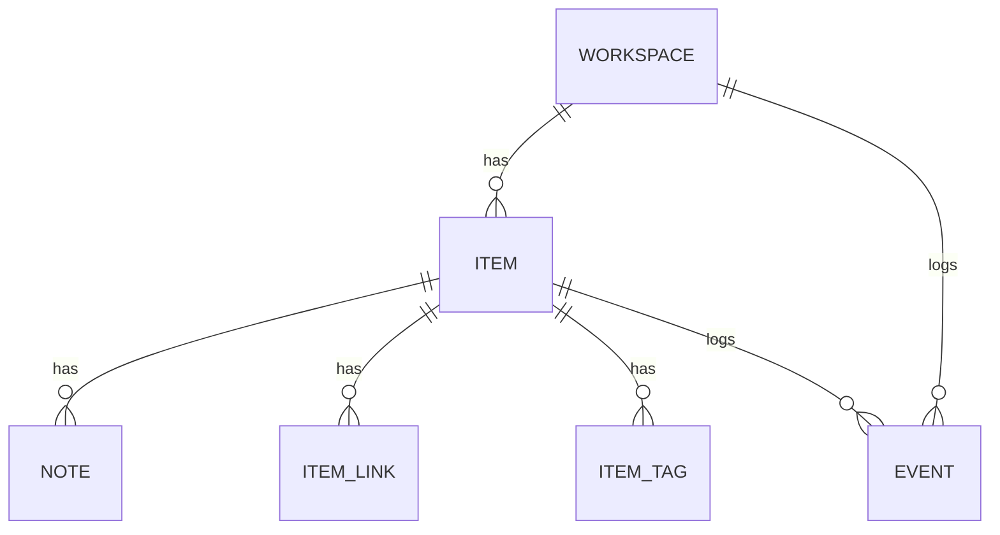
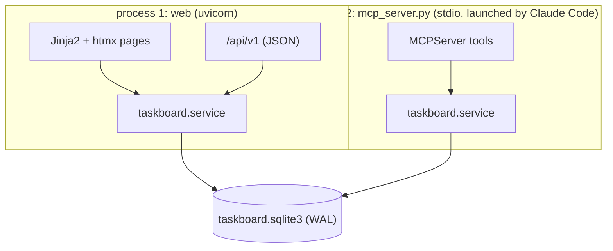

# AI タスクボード SPEC — 人と AI が一緒に書く「候補・残項目」ボード

- 版: v0.1（設計のみ・**コード未着手**）／2026-09-12／起草: 設計担当の AI（人間がレビュー）
- リポジトリ: `ai-taskboard`（プロジェクト名は仮。§10-1）
- 進め方: **SPEC を先に固めてから実装**。実装は別の担当（実装担当の AI）に渡すので、**他人がこの文書だけで実装できる粒度**で書く
- 前提: 人間の要件「候補・残項目を管理整理できる Web アプリ。Claude 等の AI が書き込めて、人も書き込める。ブログ／仕事などに**ページを分ける**（項目分類ではなくワークスペースごとに別ページ）。製作過程も記事にする」＋追加指示「**ブログに載せるのはダミーデータで**」
- 本文中の ★ は決定事項（§10 に集約。既定値で進めた）。「未確認」と書いた箇所は一次資料で裏が取れていない

---

## 0. 一枚要約

| 観点 | 決定（既定値） |
|:---|:---|
| 何 | ワークスペース（＝ページ）ごとに独立した「候補・残項目」のボード。人も AI も同じ項目に書く。**誰が書いたかを全操作で残す** |
| 誰が | 単一ユーザー（人間）＋ AI（MCP で繋ぐ Claude Code。将来は REST 経由の別の AI も） |
| どこで | **ローカル専用**。既定 `127.0.0.1:8765`。LAN 公開はオプション（トークン必須） |
| 技術 | Python 3.11 / **FastAPI** / **SQLite（1 ファイル）** / **htmx 2.x**（ビルド工程なし）/ **MCP 公式 Python SDK 2.x の `MCPServer`（旧 FastMCP）** / `uv run` で起動 |
| AI の書き込み口 | **MCP サーバー（stdio）** を主、**同じ関数を REST（`/api/v1`）でも公開** |
| 初期ワークスペース | 「ブログ」「仕事」「開発」（★§10-2）。URL `/w/<slug>` |
| 列（状態） | 候補 → 着手 → 待ち（人）／待ち（AI） → 完了／保留 の 6 状態 |
| 機密 | ワークスペースごとに AI から見えるかを決める `ai_policy`。「仕事」は既定で **AI 非公開** |
| 記事 | posts 2 本（MCP チュートリアル 20260903 の続編）。**スクショ・サンプルはすべてダミーデータ** |

---

## 1. 何をするアプリか

### 1-1. 置き換えるもの

今、記事候補や残項目は次の 3 か所に散っている。

| 今の置き場 | 何が入っているか | 困りごと |
|:---|:---|:---|
| チャットの会話（Claude Code のセッション） | 運用担当の AI がセッションの最後にまとめる「残項目」 | セッションが切り替わると探せない。人間が別の場所に書き写している |
| 作業記録（タスクごとの完了報告）の「残課題」欄 | 各担当の AI がタスク完了時に書く残り | タスク単位に分かれていて横断できない。完了したかどうかを誰も更新しない |
| AI 側のメモリ（続報ウォッチのメモなど） | 続報ウォッチ・企画のタネ | AI 側の記憶であって、人間が一覧で見る UI が無い |

このアプリは、これらを **1 つのボード**に集める。人間はブラウザで見て書き、AI（運用担当）は MCP ツールで同じ項目を読み書きする。運用担当の AI の残項目管理をここへ移す＝**ドッグフーディング**が v1 の目的。

### 1-2. 既存のタスク管理との切り分け

AI チームを回す仕組みには、ふつう「作業指示の待ち行列」（タスク管理）がすでにある。このボードはそれとは別物で、置き換えない。

| | 既存のタスク管理（作業指示の待ち行列） | このボード |
|:---|:---|:---|
| 主体 | 運用担当の AI が各担当に割り当てる**作業指示**の待ち行列 | 人と AI が共有する**候補・残項目の台帳** |
| 粒度 | 1 タスク＝1 担当の 1 回ぶんの仕事 | 1 項目＝「やるかもしれないこと」「やり残したこと」。タスクになる前と、タスクが終わった後の両方 |
| 書く人 | 運用担当の AI のツール（人間は直接編集しない） | 人間と AI の両方 |
| 寿命 | タスク完了で役目を終える | 完了後も履歴として残り、記事 URL で参照される |
| 関係 | ― | 項目の `links` に `task:<外部の ID>` を入れて**参照するだけ**。同期はしない |

ボードの項目が「やる」と決まったら運用担当の AI がタスクを切り、その ID を項目のリンクに書き戻す。逆方向（タスク → ボード）は各担当の作業記録の「残課題」を運用担当の AI が `add_item` で登録する。**自動同期は作らない**（二重管理の原因になる）。

### 1-3. やらないこと（v1 のスコープ外）

- 複数ユーザー・ログイン・権限管理（単一ユーザー前提）
- クラウド同期・モバイルアプリ（LAN 閲覧まで）
- 期限のリマインド通知（メール・Slack・push）
- ガントチャート・工数管理
- 既存のタスク管理との自動同期（§1-2）
- 添付ファイル（リンクで代用）

---

## 2. 画面と URL 設計

### 2-1. URL 一覧

| URL | メソッド | 画面／役割 | 備考 |
|:---|:--|:---|:---|
| `/` | GET | ワークスペース一覧 | カードに状態別の件数 |
| `/w/{slug}` | GET | ワークスペースのボード（既定＝かんばん） | `?view=list` でリスト表示。`?status=`・`?tag=`・`?owner=`・`?q=` で絞り込み |
| `/w/{slug}/items/{id}` | GET | 項目の詳細（本文・ノート・履歴） | |
| `/w/{slug}/items/{id}/edit` | GET／POST | 項目の編集フォーム | htmx で詳細画面に差し込む |
| `/w/{slug}/items` | POST | クイック追加（タイトルだけで作る） | ボード上部の入力欄から。作成後は列の先頭に差し込む |
| `/items/{id}/move` | POST | 状態の変更（列の移動） | フォーム値 `status`・任意 `reason` |
| `/items/{id}/notes` | POST | ノート追加 | |
| `/items/{id}/complete` | POST | 完了にする（`move` の糖衣・`summary` 付き） | |
| `/workspaces/new` | GET／POST | ワークスペース追加 | slug は名前から自動生成・編集可 |
| `/w/{slug}/settings` | GET／POST | 名前・説明・`ai_policy`・アーカイブ | |
| `/api/v1/...` | ― | REST（§4-4） | JSON。`/docs` に FastAPI の OpenAPI UI が自動で出る |
| `/healthz` | GET | 稼働確認 | `{"ok": true, "db": "<path>", "version": "..."}` |

- 人間の UI は **すべてフォーム POST＋htmx の部分更新**で作る。JSON を返す API とは分ける（同じ service 関数を呼ぶ）
- `{id}` はワークスペースをまたいで一意な整数。URL に slug が入っているのは「今どのページにいるか」を保つためで、`/w/{slug}/items/{id}` の slug と項目の所属が一致しなければ 404
- 削除は作らない。**「保留」列と「アーカイブ」で代用**（履歴を消さないため）

### 2-2. ワークスペース一覧 `/`

```text
+-------------------------------------------------------------------+
| AI Taskboard                                   [+ New workspace]  |
+-------------------------------------------------------------------+
| +--------------------+ +--------------------+ +-----------------+ |
| | Blog          [AI] | | Work      [AI: no] | | Dev        [AI] | |
| | candidate 12       | | candidate  4       | | candidate  3    | |
| | doing      2       | | doing      1       | | doing      1    | |
| | waiting   1/0      | | waiting   2/0      | | waiting   0/1   | |
| | last: 2026-09-12   | | last: 2026-09-10   | | last: 2026-09-11| |
| +--------------------+ +--------------------+ +-----------------+ |
+-------------------------------------------------------------------+
```

- `[AI]` バッジ＝`ai_policy` が `read_write`。`[AI: no]`＝`hidden`（MCP／REST から見えない）
- `waiting 1/0` は 待ち（人）／待ち（AI） の件数
- ワイヤーフレーム内は桁ズレ防止のため半角のみ（実 UI は日本語）

### 2-3. ボード `/w/{slug}`（かんばん・既定）

```text
+----------------------------------------------------------------------+
| < Workspaces   Blog                        [kanban|list] [settings]  |
| [ quick add: title ........................................ ] [Add]  |
| filter: [status v] [tag v] [owner v] [q ......] [x]                  |
+-----------+-----------+-----------+-----------+----------+-----------+
| Candidate | Doing     | Wait(H)   | Wait(AI)  | Done     | Hold      |
| (12)      | (2)       | (1)       | (0)       | (30)     | (2)       |
+-----------+-----------+-----------+-----------+----------+-----------+
| #41 [AI]  | #38       | #35 [AI]  |           | #12      | #7        |
| 555 tim.. | KiCad 10..| photo x5..|           | NE555..  | old idea  |
| P:high    | P:normal  | P:high    |           |          |           |
| due 09/20 | owner:H   | owner:H   |           | 09/01    |           |
| [> move]  | [> move]  | [> move]  |           |          |           |
+-----------+           +-----------+           +----------+           |
| #40       |           |           |           | #11      |           |
| ESP32 ..  |           |           |           | ...      |           |
+-----------+-----------+-----------+-----------+----------+-----------+
```

- 列＝状態（§3-2 の 6 値）。カードは `#id`・タイトル（1 行で省略）・優先度・期限・担当・**`[AI]` バッジ（作成者が `ai:*`）**
- `[> move]` は `<select>`＋htmx の `hx-post="/items/{id}/move"`。ドラッグ＆ドロップは **v1 では作らない**（htmx だけで完結させるため。§11）
- 「完了」列は直近 20 件だけ表示し、残りは `?view=list&status=done` へ
- カードのクリックで詳細へ。詳細は同じページに htmx で差し込んでもよいが、**URL は必ず `/w/{slug}/items/{id}` で直接開ける**こと（AI が返す URL を人間がそのまま踏むため）

### 2-4. ボード（リスト表示 `?view=list`）

```text
+----------------------------------------------------------------------+
| id  | title                     | status    | pri  | owner | due     |
+-----+---------------------------+-----------+------+-------+---------+
| #41 | 555 timer article  [AI]   | candidate | high | H     | 09/20   |
| #40 | ESP32 temp logger         | candidate | norm | -     | -       |
| #38 | KiCad 10 follow-up        | doing     | norm | H     | -       |
+-----+---------------------------+-----------+------+-------+---------+
| sort: [updated v]  page 1/3  [< prev] [next >]                       |
+----------------------------------------------------------------------+
```

★かんばんとリストのどちらを既定にするかは §10-5。両方作り、既定だけ設定で切り替える。

### 2-5. 項目の詳細 `/w/{slug}/items/{id}`

```text
+-----------------------------------------------------------------------+
| < Blog board                                                          |
| #41  555 timer article (IC lab #6)                    [edit] [move v] |
| status: candidate   priority: high   owner: human   due: 2026-09-20   |
| tags: [ic-lab] [ne555]   created by: ai:claude-manager  2026-09-12    |
| links: article /posts/ne555n-cmos-timer-ic-experiments/  task PROJ-1  |
+-----------------------------------------------------------------------+
| BODY (markdown rendered)                                              |
|  - why: ...                                                           |
|  - scope: ...                                                         |
+-----------------------------------------------------------------------+
| NOTES                                                                 |
|  [AI] ai:claude-manager  2026-09-12 10:02  "hearing round 2 done"     |
|  [H]  human             2026-09-12 12:30  "photos this weekend"       |
|  [ add note ....................................... ] [Post]          |
+-----------------------------------------------------------------------+
| HISTORY (events, newest first)                                        |
|  2026-09-12 12:30  human             note.added                       |
|  2026-09-12 10:02  ai:claude-manager item.moved  candidate -> doing   |
|  2026-09-12 09:40  ai:claude-manager item.created                     |
+-----------------------------------------------------------------------+
```

- 本文は Markdown。レンダリングはサーバー側（Python の `markdown` か `markdown-it-py`。★未確定・§5-3）で行い、**生 HTML は許可しない**（AI が書いた文字列をそのまま描画するため、サニタイズは必須）
- ノートは追記のみ（編集・削除なし）。履歴（event）は表示専用
- `[edit]` は本文・タイトル・優先度・担当・期限・タグ・リンクの編集。状態は `[move v]` からだけ変える（**状態変更を必ず event に残す**ため、フォーム編集で状態を変えられないようにする）

### 2-6. 画面遷移（mermaid）



---

## 3. データモデル

### 3-1. 概念



### 3-2. 値の決まり

| 名前 | 取りうる値 | 説明 |
|:---|:---|:---|
| `status` | `candidate` / `doing` / `waiting_human` / `waiting_ai` / `done` / `hold` | 列。UI 表示は 候補／着手／待ち（人）／待ち（AI）／完了／保留 |
| `priority` | `low` / `normal` / `high` / `urgent` | 既定 `normal` |
| `owner` | `human` / `ai:<name>` / NULL | **次に動く人**。作成者（author）とは別 |
| `author`（作成者・記録者） | `human` / `ai:<name>` | `<name>` は `^[a-z0-9][a-z0-9._-]{0,39}$`。例 `ai:claude-manager`・`ai:gemini-analytics` |
| `ai_policy`（ワークスペース） | `read_write` / `read_only` / `hidden` | MCP／REST から見えるか・書けるか。既定: ブログ＝`read_write`、開発＝`read_write`、**仕事＝`hidden`** |
| `link.kind` | `article` / `task` / `url` | `article` はサイト内パス（`/posts/...`）、`task` は外部タスク管理の ID（例: チケット番号）、`url` はそれ以外 |
| `event.kind` | `item.created` / `item.updated` / `item.moved` / `item.completed` / `note.added` / `workspace.created` / `workspace.updated` | 追記のみ |

状態遷移は**制限しない**（どの列からどの列へも移せる）。ただし `done` へ移すときは `completed_at` を打ち、`done` から出すときは NULL に戻す。

### 3-3. SQLite DDL 案

```sql
PRAGMA journal_mode = WAL;        -- Web と MCP の 2 プロセスが同じファイルを開くため
PRAGMA foreign_keys = ON;         -- 接続ごとに必ず ON にする（SQLite の既定は OFF）
PRAGMA busy_timeout = 5000;       -- 書き込み競合時に 5 秒待つ

CREATE TABLE workspace (
  id          INTEGER PRIMARY KEY,
  slug        TEXT NOT NULL UNIQUE,                 -- ^[a-z0-9][a-z0-9-]{0,39}$
  name        TEXT NOT NULL,
  description TEXT NOT NULL DEFAULT '',
  ai_policy   TEXT NOT NULL DEFAULT 'read_write'
              CHECK (ai_policy IN ('read_write','read_only','hidden')),
  sort_order  INTEGER NOT NULL DEFAULT 0,
  created_at  TEXT NOT NULL,                        -- ISO 8601 UTC 'YYYY-MM-DDTHH:MM:SSZ'
  archived_at TEXT
);

CREATE TABLE item (
  id           INTEGER PRIMARY KEY,
  workspace_id INTEGER NOT NULL REFERENCES workspace(id),
  title        TEXT NOT NULL CHECK (length(title) BETWEEN 1 AND 200),
  body         TEXT NOT NULL DEFAULT '',            -- Markdown
  status       TEXT NOT NULL DEFAULT 'candidate'
               CHECK (status IN ('candidate','doing','waiting_human','waiting_ai','done','hold')),
  priority     TEXT NOT NULL DEFAULT 'normal'
               CHECK (priority IN ('low','normal','high','urgent')),
  owner        TEXT,                                -- 'human' | 'ai:<name>' | NULL
  due          TEXT,                                -- 'YYYY-MM-DD' | NULL
  created_by   TEXT NOT NULL,                       -- author
  created_at   TEXT NOT NULL,
  updated_at   TEXT NOT NULL,
  completed_at TEXT,
  sort_order   INTEGER NOT NULL DEFAULT 0           -- 列内の並び（小さいほど上）
);
CREATE INDEX item_ws_status ON item(workspace_id, status, sort_order);
CREATE INDEX item_updated   ON item(updated_at);

CREATE TABLE item_tag (
  item_id INTEGER NOT NULL REFERENCES item(id) ON DELETE CASCADE,
  tag     TEXT NOT NULL CHECK (tag = lower(tag) AND length(tag) BETWEEN 1 AND 40),
  PRIMARY KEY (item_id, tag)
);
CREATE INDEX item_tag_tag ON item_tag(tag);

CREATE TABLE item_link (
  id      INTEGER PRIMARY KEY,
  item_id INTEGER NOT NULL REFERENCES item(id) ON DELETE CASCADE,
  kind    TEXT NOT NULL CHECK (kind IN ('article','task','url')),
  target  TEXT NOT NULL,                            -- '/posts/xxx/' | 't-xxxx' | 'https://...'
  label   TEXT NOT NULL DEFAULT ''
);

CREATE TABLE note (
  id         INTEGER PRIMARY KEY,
  item_id    INTEGER NOT NULL REFERENCES item(id) ON DELETE CASCADE,
  body       TEXT NOT NULL CHECK (length(body) BETWEEN 1 AND 4000),  -- Markdown
  author     TEXT NOT NULL,
  created_at TEXT NOT NULL
);
CREATE INDEX note_item ON note(item_id, created_at);

CREATE TABLE event (                                -- 追記のみ。UPDATE/DELETE しない
  id           INTEGER PRIMARY KEY,
  workspace_id INTEGER NOT NULL REFERENCES workspace(id),
  item_id      INTEGER REFERENCES item(id),
  kind         TEXT NOT NULL,
  author       TEXT NOT NULL,
  payload      TEXT NOT NULL DEFAULT '{}',          -- JSON。moved なら {"from":..,"to":..,"reason":..}
  source       TEXT NOT NULL CHECK (source IN ('ui','mcp','rest','import')),
  created_at   TEXT NOT NULL
);
CREATE INDEX event_ws_time   ON event(workspace_id, created_at);
CREATE INDEX event_item_time ON event(item_id, created_at);

CREATE TABLE schema_version (version INTEGER NOT NULL);
INSERT INTO schema_version VALUES (1);
```

設計メモ

- **ON DELETE CASCADE は「万一の手動 DELETE」の保険**。アプリからは DELETE を発行しない
- 時刻は UTC の ISO 8601 文字列。表示時にローカル（JST）へ変換。SQLite の `datetime()` 関数で比較できる形式にそろえる
- `sort_order` の再採番は「列を移動したとき、移動先の先頭＝現在の最小値 − 1」。並べ替え UI は v1 では作らない
- マイグレーションは `schema_version` を見て `migrations/000N_*.sql` を順に適用する自前の最小実装（Alembic は入れない）
- 全文検索（`?q=`）は v1 では `LIKE '%q%'` で十分。件数が増えたら FTS5 を検討（SQLite 同梱・追加依存なし）

### 3-4. 参考: 項目 1 件の JSON 表現（REST・MCP 共通）

```json
{
  "id": 41,
  "workspace": "blog",
  "title": "555 タイマーの記事（IC 実験室 #6）",
  "body": "- なぜ: ...\n- 範囲: ...",
  "status": "candidate",
  "priority": "high",
  "owner": "human",
  "due": "2026-09-20",
  "tags": ["ic-lab", "ne555"],
  "links": [
    {"kind": "article", "target": "/posts/ne555n-cmos-timer-ic-experiments/", "label": "前作"},
    {"kind": "task", "target": "PROJ-123", "label": ""}
  ],
  "created_by": "ai:claude-manager",
  "created_at": "2026-09-12T00:40:00Z",
  "updated_at": "2026-09-12T03:30:00Z",
  "completed_at": null,
  "url": "http://127.0.0.1:8765/w/blog/items/41"
}
```

`url` は**サーバーが組み立てて返す**（AI が人間に「ここを見て」と渡せるように）。

---

## 4. AI の書き込み口 — MCP ツールと REST

### 4-1. 構成



- **service 層（`taskboard/service.py`）が唯一の書き込み経路**。UI・REST・MCP はすべてこの関数群を呼ぶ。event の記録も service 層で行う（呼び出し側が忘れられない）
- MCP サーバーは **Web サーバーが起動していなくても動く**（同じ SQLite を直接開く）。Claude Code が stdio で子プロセスとして起動する（MCP SDK: 「The host launches your file as a subprocess and speaks over its stdin and stdout」— run/ ページ）
- MCP サーバーの **author は環境変数 `TASKBOARD_AUTHOR` で固定**（例 `ai:claude-manager`）。ツール引数で author を上書きさせない（なりすまし防止・§6）
- REST の author は必須ヘッダ `X-Taskboard-Author`。UI は常に `human`

### 4-2. MCP ツール定義（7 本＋補助 2 本）

共通の約束

- 引数は JSON Schema に落ちる型だけ（`str` / `int` / `list[str]` / `Literal[...]` / Pydantic モデル）。**docstring と引数名がそのまま AI への説明になる**ので単位・候補値を書く（MCP チュートリアル記事の教訓）
- 戻り値は **Pydantic モデル**（SDK が `structured_content` を作る。structured-output ページ「Object schema with no wrapper」）。一覧は `list[ItemSummary]` ではなく `ItemList` モデルで包む（リストは `{"result": [...]}` に包まれるうえ、件数・次ページを載せたい）
- 失敗は **`ToolError`（`mcp.server.mcpserver.exceptions`）を raise** する。「Never return an error message from a tool. A returned string has `is_error=False`」（handling-errors ページ）。`MCPError` は使わない（モデルに文言が届かないため）
- `hidden` のワークスペースは**存在しないものとして扱う**（一覧に出さず、指定されたら `ToolError("workspace 'x' not found")`）。`read_only` は書き込み系で `ToolError("workspace 'x' is read-only for AI")`
- 書き込み系は event を残し、`source='mcp'`

| # | ツール | 引数（型・既定） | 戻り値 | ToolError になる条件 |
|--:|:---|:---|:---|:---|
| 1 | `list_items` | `workspace: str`（slug）／`status: Literal[6 値] \| None`／`tag: str \| None`／`owner: str \| None`／`query: str \| None`（タイトル・本文の部分一致）／`limit: int = 50`（1〜200）／`offset: int = 0` | `ItemList {items: list[ItemSummary], total: int, next_offset: int \| None}` | workspace 不明・hidden／limit 範囲外 |
| 2 | `add_item` | `workspace: str`／`title: str`（1〜200）／`body: str = ""`／`priority: Literal[4 値] = "normal"`／`owner: str \| None`／`due: str \| None`（`YYYY-MM-DD`）／`tags: list[str] = []`／`links: list[Link] = []` | `Item`（§3-4 の全項目＋`url`） | workspace 不明・hidden・read_only／title 空／due 形式違い／owner 形式違い |
| 3 | `update_item` | `item_id: int`＋任意 `title`・`body`・`priority`・`owner`・`due`・`tags`（全置換）・`links`（全置換）。**`status` は受けない** | `Item` | item 不明／所属 workspace が hidden・read_only／変更が 1 つも無い |
| 4 | `move_item` | `item_id: int`／`status: Literal[6 値]`／`reason: str = ""` | `Item` | item 不明／同じ status への移動／hidden・read_only |
| 5 | `add_note` | `item_id: int`／`body: str`（1〜4000・Markdown） | `Note {id, item_id, body, author, created_at}` | item 不明／body 空／hidden・read_only |
| 6 | `complete_item` | `item_id: int`／`summary: str = ""`（完了ノートとして残す） | `Item` | item 不明／すでに done／hidden・read_only |
| 7 | `get_workspace_summary` | `workspace: str` | `WorkspaceSummary {workspace, name, counts: dict[status,int], overdue: list[ItemSummary], waiting_ai: list[ItemSummary], recent_events: list[EventSummary]（直近 20）, url}` | workspace 不明・hidden |
| 8 | `get_item`（補助） | `item_id: int` | `ItemDetail {item: Item, notes: list[Note], events: list[EventSummary]}` | item 不明／hidden |
| 9 | `list_workspaces`（補助） | なし | `WorkspaceList {workspaces: list[{slug, name, ai_policy, counts}]}` | ―（hidden は出さない） |

`ItemSummary` は `Item` から `body` を抜いたもの（一覧で本文を返すとコンテキストを食うため）。`EventSummary = {created_at, author, kind, item_id, payload}`。

運用担当の AI の使い方の想定（ドッグフーディング）

1. セッション開始時に `get_workspace_summary("blog")` と `("dev")` で残項目を把握
2. 人間の指示で候補が出たら `add_item(...)`、タスクに切ったら `update_item(links=[{"kind":"task","target":"<外部の ID>"}])`＋`move_item(status="doing")`
3. 各担当の作業記録の残課題を `add_item(status は candidate のまま, owner="human" or "ai:...")`
4. 人間の判断待ちは `move_item(status="waiting_human", reason="...")`。人間は UI で見て `waiting_ai` に戻す

### 4-3. MCP サーバーの起動と Claude Code 側の設定

サーバー本体（ここは形だけ。実装は `src/taskboard/mcp_server.py`）

```text
mcp_server.py
  mcp = MCPServer("taskboard")      # from mcp.server import MCPServer  （SDK 2.x。1.x の FastMCP は使わない）
  @mcp.tool() ... 上の 9 本
  if __name__ == "__main__": mcp.run()   # 引数なし＝stdio
```

Claude Code への登録（MCP チュートリアル記事と同じ流儀＝**インタプリタもスクリプトもフルパス**）

```powershell
claude mcp add --transport stdio -s user taskboard `
  -e TASKBOARD_DB=C:\path\to\ai-taskboard\data\taskboard.sqlite3 `
  -e TASKBOARD_AUTHOR=ai:claude-manager `
  -- C:\path\to\ai-taskboard\.venv\Scripts\python.exe C:\path\to\ai-taskboard\mcp_server.py
```

（`ai:claude-manager` は author 名の例。実装では起動コマンドを `uv run --directory C:/path/to/ai-taskboard taskboard mcp` にした。README 参照）

- `--` の後ろがサーバー起動コマンド（Claude Code docs: 「The `--` (double dash) separates Claude's own options ... from the command and arguments that run the server」）
- スコープは `-s user`（どのフォルダで Claude Code を起動しても運用担当の AI がボードを見られるように）。チームの他メンバーに見せたくなければ `local`
- 確認は `claude mcp list` の `✔ Connected` と、Claude Code 内の `/mcp`
- `.mcp.json` に書く場合（リポジトリ同梱用）は `${TASKBOARD_DB:-C:\\path\\to\\ai-taskboard\\data\\taskboard.sqlite3}` のように `${VAR:-default}` 展開が使える（Claude Code docs）

Claude Code 側の権限: ツール名は `mcp__taskboard__add_item` のように `mcp__<server>__<tool>` になる。ホスト側の permissions で書き込み系を許可リストに入れる（`mcp__taskboard__*`）。★§10-6

### 4-4. REST との対応表（`/api/v1`）

| MCP ツール | REST | 備考 |
|:---|:---|:---|
| `list_workspaces` | `GET /api/v1/workspaces` | |
| `get_workspace_summary` | `GET /api/v1/workspaces/{slug}/summary` | |
| `list_items` | `GET /api/v1/workspaces/{slug}/items?status=&tag=&owner=&q=&limit=&offset=` | |
| `add_item` | `POST /api/v1/workspaces/{slug}/items` | body は §3-4 の入力部分 |
| `get_item` | `GET /api/v1/items/{id}` | notes・events 込み |
| `update_item` | `PATCH /api/v1/items/{id}` | `status` を含んでいたら 400 |
| `move_item` | `POST /api/v1/items/{id}/move` `{"status": "...", "reason": "..."}` | |
| `add_note` | `POST /api/v1/items/{id}/notes` `{"body": "..."}` | |
| `complete_item` | `POST /api/v1/items/{id}/complete` `{"summary": "..."}` | |
| ― | `GET /api/v1/events?workspace=&since=&limit=` | 監査用。MCP には出さない |

- 認証: **`Authorization: Bearer <TASKBOARD_TOKEN>` を必須**（localhost でも。REST は他の AI・スクリプトから叩く前提なので、UI と違って無認証にしない）
- 作成者: **`X-Taskboard-Author: ai:<name>`**（例 `ai:gemini-analytics`）を必須。形式違いは 400
- エラーは FastAPI 標準の `{"detail": "..."}`。404（不明）／400（検証）／403（`ai_policy`）／409（同じ状態への移動・二重完了）
- `ai_policy` の扱いは MCP と同じ（hidden＝404）。**UI（`/w/...`）だけが hidden を見られる**
- OpenAPI は `/docs`（FastAPI 自動生成）。REST 経由で繋ぐ別の AI にはこの URL を渡せば済む

---

## 5. 技術選定と理由

### 5-1. 採用（一次資料・2026-09-12 時点の版）

| 部品 | 版 | ライセンス | 一次資料 | 採る理由 |
|:---|:---|:---|:---|:---|
| Python | 3.11.9（手元）。要件 ≥3.10 | PSF | python.org | MCP SDK・FastAPI とも `>=3.10`。MCP チュートリアル記事と同じ環境 |
| **FastAPI** | 0.141.1 | MIT | https://fastapi.tiangolo.com/ ／テンプレート: `/advanced/templates/`（`Jinja2Templates`）／テスト: `/tutorial/testing/`（`TestClient`＝httpx） | 型で入力検証・OpenAPI が自動で出る（REST を他 AI に渡すとき `/docs` を見せるだけ）。MCP SDK と同じ Pydantic モデルを流用できる |
| uvicorn | 0.52.4 | BSD-3-Clause | https://www.uvicorn.org/ | FastAPI 公式の ASGI サーバー |
| Jinja2 | 3.1.6 | BSD-3-Clause | https://jinja.palletsprojects.com/ | FastAPI 公式が案内するテンプレート |
| python-multipart | 0.0.32 | Apache-2.0 | FastAPI docs `/tutorial/request-forms/` | フォーム POST に必要（FastAPI が要求） |
| **SQLite** | 3.53.4（sqlite.org 表示）。Python 同梱の `sqlite3` を使う | Public Domain（sqlite.org/copyright.html） | https://sqlite.org/ ／WAL: https://sqlite.org/wal.html ／Python: https://docs.python.org/3/library/sqlite3.html | 1 ファイル＝バックアップがコピー 1 回。追加のサーバー不要。2 プロセス（Web・MCP）からの同時アクセスは WAL で足りる規模 |
| **htmx** | **2.0.10**（htmx.org の Quick start が案内する版。CDN: `https://cdn.jsdelivr.net/npm/htmx.org@2.0.10/dist/htmx.min.js`） | Zero-Clause BSD（リポジトリ LICENSE） | https://htmx.org/ ／リファレンス: https://htmx.org/reference/ | ビルド工程なしで部分更新ができる。**4.0.0 が 2026-08-28 に出ているが、htmx.org は「not currently marked as `latest` in NPM so that people using the 2.x line are not accidentally upgraded」としており、v1 は 2.x で作る**。オフラインでも動くようファイルを `static/` に同梱する（CDN 依存にしない） |
| **MCP 公式 Python SDK** | `mcp` **2.2.0** | MIT | https://py.sdk.modelcontextprotocol.io/ ／ツール: `/servers/tools/` ／構造化出力: `/servers/structured-output/` ／エラー: `/servers/handling-errors/` ／起動: `/run/` ／テスト: `/get-started/testing/` ／ホスト接続: `/get-started/real-host/` ／GitHub: https://github.com/modelcontextprotocol/python-sdk | **2.x では `FastMCP` が `MCPServer` に改名**（`from mcp.server import MCPServer`）。当初案の「FastMCP」はこの `MCPServer` を指すものとして扱う。別プロジェクトの jlowin/fastmcp（2.x 系・Apache-2.0）は**使わない**（公式 SDK で足りる・記事の一貫性） |
| MCP Inspector | `mcp dev server.py` で起動（`npx` が必要） | MIT（GitHub 表示） | https://github.com/modelcontextprotocol/inspector | ツールを手で叩いて確認する UI。v0.3 の検証に使う |
| uv | 0.12.13 | Apache-2.0（GitHub API 表示。リポジトリは MIT/Apache デュアル表記の可能性あり・**未確認**） | https://docs.astral.sh/uv/ ／`/concepts/projects/run/` | `uv run` で仮想環境の有効化なしに起動。MCP SDK docs も `uv run mcp dev` を案内 |
| pytest | 9.1.1 | MIT | https://docs.pytest.org/ | FastAPI・MCP SDK の両方が pytest 前提 |
| httpx | 0.28.1 | BSD-3-Clause | https://www.python-httpx.org/ | `TestClient` の依存 |

### 5-2. なぜこの組み合わせか（一言ずつ）

- **ビルド工程ゼロ**: `uv run taskboard serve` で立ち上がり、テンプレートを直したら再読み込みで反映。記事で「読者が同じ手順を踏める」ことを優先
- **1 プロセス 1 責務**: Web と MCP を別プロセスにし、共有するのは SQLite ファイルだけ。どちらかが落ちてももう片方は動く
- **同じ関数を 3 つの入口から**: UI・REST・MCP が同じ service 層を呼ぶので、機能追加は 1 か所。テストも service 層に集中させる
- **MCP チュートリアル記事の続編として自然**: 前作が「計算 3 つの MCP」、今作が「状態を持つ MCP（DB に書く）」。SDK・登録手順・エラーの流儀が同じ

### 5-3. 着手時に確定した事項（2026-09-12・実装着手時）

- **Python: uv 管理の 3.12（3.12.12）で確定**（`.python-version` = 3.12・`requires-python >= 3.12`）。§0／§5-1 の「3.11」はこの決定で読み替える（本節以外は原文のまま）
- **Markdown レンダラ: `markdown-it-py` 4.2.0（MIT）で確定**。`MarkdownIt("commonmark", {"html": False})` に table / strikethrough を有効化。生 HTML はエスケープされ、`javascript:`・`data:` 等の URL は markdown-it の既定 validateLink が落とす。リンクは `rel="noopener noreferrer"`、外部 URL は `target="_blank"`。テンプレートは Jinja2 autoescape
- CSS: 自前の最小 CSS 1 ファイル（`static/style.css`・約 100 行）。フレームワーク無し。ダークモードは `prefers-color-scheme` のみ
- 起動コマンド: `uv run taskboard serve` / `init-db` / `seed --demo` / `import` / `backup`（`pyproject.toml` の `[project.scripts]`）。`serve` に `--host` は用意しない（127.0.0.1 固定）
- htmx 2.0.10 を `src/taskboard/static/htmx.min.js` に同梱（SHA-384 が htmx.org 掲載の integrity 値と一致）
- 取り込みの任意拡張: 項目の `"moves": [{"to", "author", "reason"}]`（作成後に順に move_item。ダミー DB の履歴作りに使用）

---

## 6. セキュリティと運用

### 6-1. バインドと認証

| 経路 | 既定 | LAN 公開時（★§10-3） |
|:---|:---|:---|
| Web UI | `127.0.0.1:8765`・無認証 | `--host 0.0.0.0`。**`TASKBOARD_TOKEN` 未設定なら起動を拒否**。Cookie セッションに Bearer 相当のトークンを一度入力（ログイン画面 1 枚） |
| REST | 常に `Authorization: Bearer` 必須 | 同じ |
| MCP（stdio） | ネットワークに出ない（子プロセス）。認証なし | 変わらない |

- HTTPS は v1 で扱わない（LAN 内・自宅前提）。外に出すなら Tailscale 等のオーバーレイで包む（**スコープ外・記述のみ**）
- MCP を Streamable HTTP で公開する案は v1 では採らない（§11）。SDK docs も `transport_security`（DNS rebinding 対策）は「until you deploy somewhere other than localhost」としている

### 6-2. 機密の扱い（仕事ページ）

- ワークスペースの `ai_policy` が唯一のスイッチ。**「仕事」は既定 `hidden`**＝MCP・REST の一覧に出ず、ID 指定でも「見つからない」を返す
- `read_only` は「AI に要約はさせたいが書かせない」用。`read_write` はブログ・開発の既定
- **人間が AI に渡すときの注意**（記事にも書く）: `hidden` のワークスペースにある内容を、人間がチャットに貼れば当然 AI に渡る。アプリが守れるのは「AI が自分で読みに行けない」ことだけ
- ログ: リクエストログに本文・ノートを出さない（ID と kind だけ）。`event.payload` に本文は入れない（`item.updated` は変更したフィールド名のみ）
- 記事・スクショは §8 のダミー DB からだけ撮る。実 DB のパスと同じ画面を出さない

### 6-3. バックアップと復旧

- **1 ファイルなのでコピーが正**。ただし WAL 中は `taskboard.sqlite3-wal` も一緒に必要なので、`uv run taskboard backup` は Python `sqlite3` の `Connection.backup()`（オンラインバックアップ API・docs.python.org）で `backups/taskboard-YYYYMMDD-HHMM.sqlite3` に書く
- 実行タイミング: Web サーバー起動時に 1 回＋1 日 1 回（サーバー内の簡易スケジューラ。外部 cron は使わない）。世代は 30 個まで
- 復旧: サーバーを止めてファイルを戻す。`schema_version` が新しければマイグレーションを再適用
- `data/`・`backups/` は `.gitignore`。**DB はリポジトリに入れない**（機密）

### 6-4. 起動と常駐

- 手動起動が既定（`uv run taskboard serve`）。Windows のスタートアップ登録・サービス化は**やらない**（v1）。★必要なら §10 で
- 停止は Ctrl+C。SQLite は WAL なので途中停止でも壊れない前提（sqlite.org/wal.html）

---

## 7. 初期データの取り込み

実運用の初期データはリポジトリに含めない（運用者が手元で用意して取り込む）。SPEC では形式だけ決める。例の項目は架空。

### 7-1. JSON（正）

```json
{
  "format": "taskboard-import",
  "version": 1,
  "workspaces": [
    {"slug": "blog", "name": "ブログ", "ai_policy": "read_write"},
    {"slug": "work", "name": "仕事", "ai_policy": "hidden"},
    {"slug": "dev",  "name": "開発", "ai_policy": "read_write"}
  ],
  "items": [
    {
      "workspace": "blog",
      "title": "555 タイマーの記事を書く（IC 実験室 #6）",
      "body": "- 無安定／単安定の波形写真\n- 周波数の式の検算",
      "status": "waiting_human",
      "priority": "high",
      "owner": "human",
      "due": null,
      "tags": ["ic-lab", "ne555"],
      "links": [{"kind": "task", "target": "PROJ-123", "label": "ドラフト"}],
      "created_by": "ai:claude-manager",
      "notes": [
        {"author": "ai:claude-manager", "body": "ドラフトの骨子を作成。波形写真 3 枚が必要"}
      ]
    }
  ]
}
```

- `uv run taskboard import path.json [--dry-run]`。`workspace` の slug が無ければ作る。`status`・`priority` の既定は §3-2
- 取り込みは `source='import'` の event を残す（`item.created` の payload に `{"import_file": "..."}`）
- 同じタイトルが同じワークスペースにあれば**スキップして報告**（上書きしない）

### 7-2. CSV（人間が表計算で書く用・副）

ヘッダ固定: `workspace,title,status,priority,owner,due,tags,body`。`tags` は `;` 区切り。本文の改行は `\n` リテラル。リンク・ノートは CSV では扱わない（JSON へ）。

---

## 8. 記事プラン（posts 2 本・**すべてダミーデータ**）

### 8-0. ダミーデータ一式（`seed/demo.json`・`uv run taskboard seed --demo` で `data/demo.sqlite3` に投入）

- ワークスペース: 「ブログ」「工作室」「読書」の 3 つ（**実運用の「仕事」は作らない**。仕事ページの存在を記事で匂わせない）
- 項目 18 件（各 6 件・状態を全 6 列にばらす）。例: 「555 タイマーの記事を書く」「ESP32 の温度ロガー」「はんだ吸い取り器のレビュー」「トランジスタ増幅の実験を撮り直す」「積読: 定本 トランジスタ回路の設計」— **架空だが本サイトの読者に馴染む題材**
- AI の書き込み例: AI が作った項目 5 件・ノート 6 件・`item.moved` の履歴 4 件（「候補 → 着手」「着手 → 待ち（人）」…）。**author 名は `ai:demo-assistant`**（実運用の名前を出さない）
- 人間の書き込み例: `human` のノート 4 件・クイック追加 3 件
- スクショはこの DB を `TASKBOARD_DB=data/demo.sqlite3` で立ち上げて撮る。**実 DB のスクショ・実項目の引用は禁止**

### 8-1. 記事①「候補と残項目を人と AI で管理する自作 Web アプリ｜FastAPI＋SQLite＋htmx で動くまで」

- 位置づけ: 設計 → v0.2 まで。**MCP は出さない**（②の引き）
- 見せ場: (1) 「なぜ既製のタスク管理ではなく作るのか」を §1 と §11 の比較表で（AI が書ける口・ページ分割・ローカル完結）／(2) htmx で「JS を書かずに列が動く」瞬間（`hx-post` 1 行のカード移動）／(3) event テーブルで「誰が書いたか」が全部残る画面
- スクショ計画（ダミー DB）: ワークスペース一覧／かんばん／詳細（ノートに `[AI]` バッジ）／履歴／`/docs`
- 図: §2-6 の画面遷移・§3-1 の ER 図（mermaid）
- 相互リンク: MCP チュートリアル（`/posts/claude-code-mcp-server-tutorial-python/`）へ「次回はここに MCP を生やす」。②公開後に①へ②のリンクを追記
- 分量の目安: 前作と同じ 500 行前後。コードは要点だけ（全文は GitHub・★リポジトリ公開の可否は §10-7）

### 8-2. 記事②「自作 Web アプリに MCP を生やして Claude Code から書き込む｜状態を持つ MCP サーバーの作り方」

- 位置づけ: v0.3。前作（計算＝状態なし）との差分＝**DB に書く MCP** に絞る
- 見せ場: (1) `MCPServer` に 9 本のツールを載せ、`claude mcp add -e TASKBOARD_AUTHOR=...` で author を固定するところ／(2) Claude Code に「候補を 3 つ足して」と頼み、ブラウザの列に `[AI]` バッジ付きで現れる瞬間（動画 or 連続スクショ）／(3) `ToolError` で「見つからない」を返すと Claude が自分で `list_items` を叩き直す様子（handling-errors ページの「self-correcting agent」を実演）／(4) `hidden` ワークスペースが AI から本当に見えないことの確認
- スクショ計画: `/mcp` の接続画面（前作と同じ体裁）・Claude Code の会話（ダミー項目のみ）・ボードの前後
- 相互リンク: ①と MCP チュートリアル。チュートリアルの「詰まったところ」（1.x/2.x・ToolError）を前提として参照し、繰り返さない
- 検証の見せ方: `mcp dev` の Inspector 画面と、pytest の in-memory `Client(mcp)` テスト（`/get-started/testing/`）を 1 つずつ

### 8-3. 記事の制約

- 「実機確認済み」等のメタ注記は書かない（既存方針）。事実は断定、未検証は明示
- 運用のディテール（外部タスク管理の ID・チーム内の名前・実際の残項目）は出さない。**実運用の author 名も記事では `ai:demo-assistant`**
- 執筆は実装が v0.3 に達してから

---

## 9. 実装のマイルストーンと検証

| 版 | 中身 | 完了の定義（検証方法） |
|:---|:---|:---|
| **v0.1** | 1 ワークスペース固定。項目の追加・一覧（かんばん＋リスト）・状態変更。SQLite・マイグレーション・`/healthz` | `pytest`: service 層（add／list／move で event が 1 件ずつ増える・status の CHECK 違反が弾かれる）＋`TestClient`（`/`・`/w/blog`・POST 追加・POST move が 200/303）。手動: ブラウザで追加→移動→再読み込みで残る |
| **v0.2** | ワークスペース分割（`/w/{slug}`・作成・設定・`ai_policy`）・詳細画面・Markdown 本文・ノート・履歴・タグ・リンク・フィルタ・バックアップコマンド・JSON/CSV 取り込み | `pytest`: hidden の UI 表示は可・ノート追記 event・import の重複スキップ・Markdown の生 HTML が無効化される（`<script>` がエスケープされる）。手動: 取り込んだ実データが 3 ページに分かれて見える |
| **v0.3** | MCP サーバー（9 ツール）＋REST（§4-4）＋Bearer/author ヘッダ。`ai_policy` の強制 | `pytest`: in-memory `Client(mcp, raise_exceptions=True)` で 9 ツール（正常系＋ToolError 系＝hidden／read_only／不明 ID／同一 status 移動）。`TestClient` で REST の 401／400／403／404／409。手動: `uv run mcp dev mcp_server.py`（Inspector）で全ツールを叩く → `claude mcp add` → `claude mcp list` が `✔ Connected` → Claude Code から `add_item` して UI に `[AI]` バッジで出る |
| **v1.0** | ドッグフーディング開始（運用担当の AI の残項目をここへ）・ダミー DB（§8-0）・記事①②公開 | 運用担当の AI が 1 週間運用して「チャットの残項目まとめ」を廃止できたか。記事は既存の検証セット（ビルド 0/0・literal `**` 0・FAQ JSON-LD 数一致） |

各版で **`uv run pytest` が緑**であること、**`data/` を消して起動しても初期化できる**ことを共通条件にする。

---

## 10. 決めたこと（既定値・本文の ★ の参照先）

| # | 決めること | 決定（既定値） | 影響 |
|--:|:---|:---|:---|
| 1 | **アプリ名**（表示名・リポジトリ名・MCP サーバー名） | `ai-taskboard` ／ MCP 名 `taskboard` | URL・記事タイトル・`claude mcp add` の名前 |
| 2 | **初期ワークスペースの名前と slug** | ブログ `blog`／仕事 `work`／開発 `dev` | 取り込み JSON・記事のダミー名との区別 |
| 3 | **LAN 公開の要否** | v1 は localhost のみ。必要ならトークン付きで `0.0.0.0` | §6-1 のログイン画面を作るかどうか |
| 4 | **Python か Node か** | Python（FastAPI）。理由 §5・見送り §11-1 | 全体 |
| 5 | **かんばん表示かリスト表示か（既定）** | かんばん既定・リストは切替 | ボードの初期表示だけ。両方作る |
| 6 | MCP ホスト（Claude Code）に**書き込み系 MCP ツールを自動許可**するか | 読み取り系は自動許可、書き込み系（add／update／move／note／complete）は許可リストに入れる | Claude Code の permissions 設定 |
| 7 | ソースを **GitHub で公開**するか（記事から全文リンク） | 公開（MIT）。DB・取り込みデータは含めない | 記事①②の「全文はこちら」 |
| 8 | 「仕事」ページの `ai_policy` 既定 | `hidden` | AI が仕事の項目を読めるか |

---

## 11. 見送った案（理由つき）

### 11-1. 実装基盤

| 案 | 見送る理由 |
|:---|:---|
| **Node（Express／Hono＋SQLite）** | MCP・REST・UI を 1 言語でまとめる点は同じだが、MCP チュートリアル記事（Python）との連続性が切れる。既定は Python。Node を選ぶなら §4 の SDK を TypeScript SDK に読み替える |
| **Streamlit** | 画面は速く作れるが、URL で項目を直接開く（`/w/{slug}/items/{id}`）・フォーム POST・部分更新に向かない。AI が返す URL を人間が踏む運用と相性が悪い |
| **SPA（React／Vue＋API）** | ビルド工程と依存が増える。1 人用の CRUD に見合わない。htmx で足りる |
| **Django** | 管理画面は魅力だが、MCP サーバーと Pydantic モデルを共有する点で FastAPI のほうが素直。規模も小さい |
| **Flask** | FastAPI との差は OpenAPI 自動生成と型検証。REST を他 AI に渡す前提なので FastAPI |
| **htmx 4.0.0** | 2026-08-28 リリース済みだが htmx.org が 2.x を既定として案内中。v1 は 2.0.10、4 系への移行は別タスク |
| **PostgreSQL 等のサーバー DB** | 1 ユーザー・ローカルで運用コストに見合わない。SQLite は WAL で 2 プロセス同時に足りる |
| **jlowin/fastmcp（サードパーティ 2.x）** | 公式 SDK 2.x の `MCPServer` で要件を満たす。記事の一貫性（前作が公式 SDK）を優先 |
| **MCP を Streamable HTTP で常時公開** | stdio なら認証・ポート・DNS rebinding を考えなくてよい。Claude Code が子プロセスで起動する運用で十分。他 AI には REST を渡す |

### 11-2. 既製ツール（API 連携で済ませる案）

| 案 | 見送る理由 |
|:---|:---|
| **Notion（API）** | AI が書ける口はあるが、仕事の項目をクラウドに置くことになる（v1 はローカル専用の前提と衝突）。ページ分割は可能。「製作過程を記事にする」題材にならない |
| **Trello（API）** | 同上（クラウド）。列＝状態の表現は近いが、author を `ai:*` で残す仕組みは自前で被せる必要がある |
| **GitHub Projects（GraphQL API）** | 開発項目には向くが、ブログ候補・仕事項目を GitHub に置く理由が無い。API が GraphQL で MCP 化の手間が本題より大きい |
| **Obsidian／Markdown ファイル＋git** | 人間には快適だが、AI が構造化して書く口（状態・履歴）が弱い。event ログを自前で持ちたい |
| **既存のタスク管理（作業指示の待ち行列）を拡張** | 役割が違う（§1-2）。担当割当の待ち行列に候補台帳を混ぜると運用が壊れる |

### 11-3. 機能

| 案 | 見送る理由 |
|:---|:---|
| ドラッグ＆ドロップで列移動 | htmx だけでは作れず JS が要る。`<select>`＋`hx-post` で同じ結果。v1.1 候補 |
| 削除機能 | 履歴を残す方針と衝突。保留列＋アーカイブで代用 |
| 通知（期限） | `get_workspace_summary` の `overdue` を運用担当の AI が毎セッション読めば足りる |
| 複数ユーザー・ログイン | 単一ユーザー前提。LAN 公開もトークン 1 本 |
| 自動同期（既存のタスク管理 ↔ ボード） | 二重管理の温床。リンクで参照するだけ |

---

## 12. 一次資料（この SPEC で参照したもの）

- FastAPI: https://fastapi.tiangolo.com/ （Templates: https://fastapi.tiangolo.com/advanced/templates/ ／Testing: https://fastapi.tiangolo.com/tutorial/testing/ ／Form: https://fastapi.tiangolo.com/tutorial/request-forms/ ）。版・ライセンスは PyPI `fastapi` 0.141.1 / MIT
- SQLite: https://sqlite.org/ （3.53.4）／ライセンス https://sqlite.org/copyright.html ／WAL https://sqlite.org/wal.html ／Python `sqlite3` https://docs.python.org/3/library/sqlite3.html
- htmx: https://htmx.org/ （Quick start の 2.0.10 と「4.0 は latest にしない」の記述）／リファレンス https://htmx.org/reference/ ／LICENSE（Zero-Clause BSD）https://github.com/bigskysoftware/htmx/blob/master/LICENSE ／リリース一覧（v4.0.0 2026-08-28・v2.0.10 2026-09-06）
- MCP Python SDK: https://py.sdk.modelcontextprotocol.io/ （`/servers/tools/`・`/servers/structured-output/`・`/servers/handling-errors/`・`/run/`・`/get-started/testing/`・`/get-started/real-host/`・`/migration/`）。PyPI `mcp` 2.2.0 / MIT
- MCP Inspector: https://github.com/modelcontextprotocol/inspector （MIT）
- Claude Code MCP: https://code.claude.com/docs/en/mcp （`claude mcp add ... -- <command>`・`-e`・`-s`・`.mcp.json` の `${VAR:-default}`・`mcp__<server>__<tool>`）
- uv: https://docs.astral.sh/uv/ （`uv run`）。GitHub release 0.12.13
- PyPI（版・ライセンス）: uvicorn 0.52.4 BSD-3 ／ Jinja2 3.1.6 ／ python-multipart 0.0.32 Apache-2.0 ／ pytest 9.1.1 MIT ／ httpx 0.28.1 BSD-3
- 前作の記事: https://electwork.net/posts/claude-code-mcp-server-tutorial-python/ （SDK 1.x→2.x の `FastMCP`→`MCPServer` 改名・`ToolError` 以外は文言が届かない・フルパス登録）

未確認: uv のライセンス表記（GitHub API は Apache-2.0。MIT とのデュアルかは未確認）／Jinja2 の PyPI メタデータに license 文字列が無い（BSD-3-Clause はプロジェクトの LICENSE による）／Markdown レンダラの選定（§5-3）
